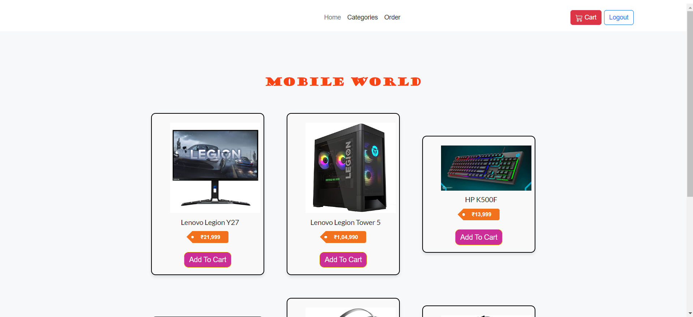

# Online EGadgets

This project is an online platform for buying and selling electronic gadgets. It provides a user-friendly interface for users to navigate through different categories of products.

## Table of Contents

- [Technologies Used](#technologies-used)
- [Features](#features)
- [Screenshots](#screenshots)
- [Installation](#installation)
- [Usage](#usage)
- [Contributing](#contributing)
- [License](#license)

## Technologies Used

- HTML
- CSS
- Bootstrap 5
- Semantic UI
- JavaScript

## Features

- Responsive design
- Navigation through different categories (Mobile, Laptop, Car, Gaming PC, Bike, Home Theater)
- Cart functionality
- Sell functionality

## Screenshots

## Installation

1. Clone the repository.
2. Open the project in a code editor.
3. Run the HTML files in a web browser.

## Usage

- Navigate through different categories by clicking on the links in the navigation bar.
- Add items to the cart by clicking on the "Add to Cart" button.
- Proceed to checkout by clicking on the cart icon in the navigation bar.

## About the Project

This project was created as part of a web development course to demonstrate proficiency in frontend technologies and e-commerce concepts.

